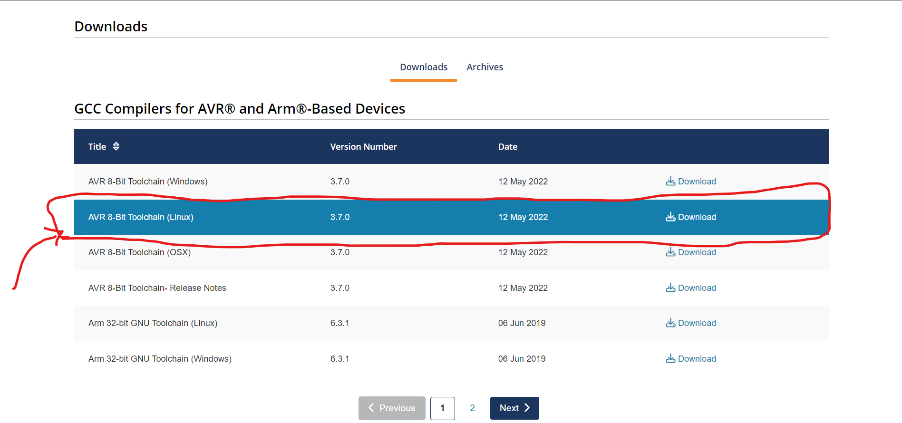

# ==**CmakeLists AVR cross compilation Repo**==

### This Repo is a cross compilation repo ==(On Linux)== for the AVR (atmega16) with the CmakeLists structure with the P1 ==MBD==
****
#### **Setup the Tool chain for build process on linux or wsl in windos**
Using the This link 👉 [AVR Tool chain](https://www.tonymitchell.ca/posts/setup-avr-toolchain-on-windows/) then inside this web page naviage to the Compilers for the AVR 8bits for linux platform in here 👉 [AVR Compilers](https://www.microchip.com/en-us/tools-resources/develop/microchip-studio/gcc-compilers) and choose the Linux compilr as shown 

Then unzip the pacakge of the compilr and put it in the /opt whit htis name convinsion ==/opt/AVR_Tool_Chain/avr8-gnu-toolchain-linux_x86_64== then you will have the tool cahin required to build the project.

****
#### **1.The Repo structure will be as bewlo**

├── CMakeLists.txt
├── Makefile
├── Notes.txt
├── swc_paths.cmake 
├── cross_compile_avr
├── build_lgs
├── build_env
├── src_code
├── Simulink_Model_sorce
├── Docs
└── scripts

###### CMakeLists.txt:
This the main CmakeLists of the repo contiaing all the Cmake Configurtion. 
###### Makefile:
This the main Makefile of the repo contiaing all make targets to be used.  
###### Notes.txt:
This txt file will contian the notes TBD during development.
###### swc_paths.cmake:
This .cmake will contain all the pathes shall be used in the repo relative to the main path of the repo so it coauld be accesed relativly in any other machine.
###### cross_compile_avr:
This is Directory which will contain the avr.Cmake file contiang the Cross compialtion tool chain pathes and configuration.
###### build_lgs:
Inside this directory there will be ***Build_log.txt*** containg all the log in the trminal during the build process. 
###### build_env:
This Directory will contain all the generated cmake build environment so the project will be built using them after  
###### src_code:
This Directory will contain all the source code (.c/.h) of all the SWCs of the project
###### Simulink_Model_sorce:
This Directory will contain source files of the Matlab and simulink project and all the generated data from the simulation to be integrated in the Source code 
###### Docs:
This Directory will contain all the documentation and pics of the project.
###### scripts:
This Directory will contain some helping scripts to be used in the repo.

*******
#### ***2.How to build the repo:***
To Build the repo you can use the make command ==***make full_build***== which will do all steps for a clean build of the repo.
The command make full_build excutes the following targets:

1. **make clean**
2. **make cmake_build**
1. **make build**

###### ==**make clean**==: 
This make target will clean the build logs and the build environment generated by the cmake from the previous build to achieve a clean build.

###### ==**make cmake_build**==:
This make target will trigger the cmake build environemt generation to generate all the cmake nad the makefiles whihc will be used during the build process.

###### ==**make build**==: 
This make target will trigger the full SW compilation process then elf and hex inage generation after the successfull compilation process.

****
#### ***3.How to Add a new SWC:***
As this repo based on CmakeLists.txt inorder to add a new SWC we need to follow the below steps:
1. Add the SWC path to the ==SWC_paths.cmake== 
```cmake
set(SWC_one "${PROJECT_SOURCE_DIR}/src_code/SWC_one")
```
1. Include the (SWCName) to be avalibe during the preproccessing stage in search of the header files
```cmake
include_directories(${SWC_one})
```
1. addsubirectory (SWCName) in the main cmakelists to be linked as a static liberary with the final exe file
```cmake
add_subdirectory(${SWC_one})
```
1. Add the (SWC_name) to the the global Environment variable named Linked_SWcs to be used in the API=>target_link_libraries(final ${Linked_SWcs})
```cmake
set(Linked_SWcs SWC_one SWC_two Model)
```
1. Add the SWC_libs directory to the linking of the elf file as this :==add_custom_target==(final_elf)
```cmake
    COMMAND ${CMAKE_COMMAND} -E echo "$<TARGET_OBJECTS:final> $<TARGET_OBJECTS:SWC_one> $<TARGET_OBJECTS:SWC_two> $<TARGET_OBJECTS:Model>" > "${CMAKE_CURRENT_BINARY_DIR}/tmp/object_files.txt"
```
*****
#### ***4.MBD Integration :***
1. The Simulink Model will be in this Path **Simulink_Model_sorce/Source_Model** in the format of ***.slx***
2. All the Generaetd files (**.c**&&**.h**) will be in this path **Simulink_Model_sorce/Source_Model/Controller_ert_rtw** there will be a file named ==**ert_main.c**== whihc will have a sample of the basic usage of the generated files, and how to be called and used.
3. The generated files shall be moved to the Direcroty of the model files which will compile as a normal SWC in the path **src_code/Model/Model_gen_data**
4. There is a make target in the main Makrfile ```make Model_clean ``` which will remove all the (**.c** & **.h**) in the **src_code/Model/Model_gen_data** then another make target ``` make Model_copy ``` which will take all the generated (**.c** & **.h**) in the **Simulink_Model_sorce/Source_Model/Controller_ert_rtw** then it will copt them to the **src_code/Model/Model_gen_data** then will give you al list of all the copied files in the terminal to add them in the CmakeLists of the Model_SWC.

*****


